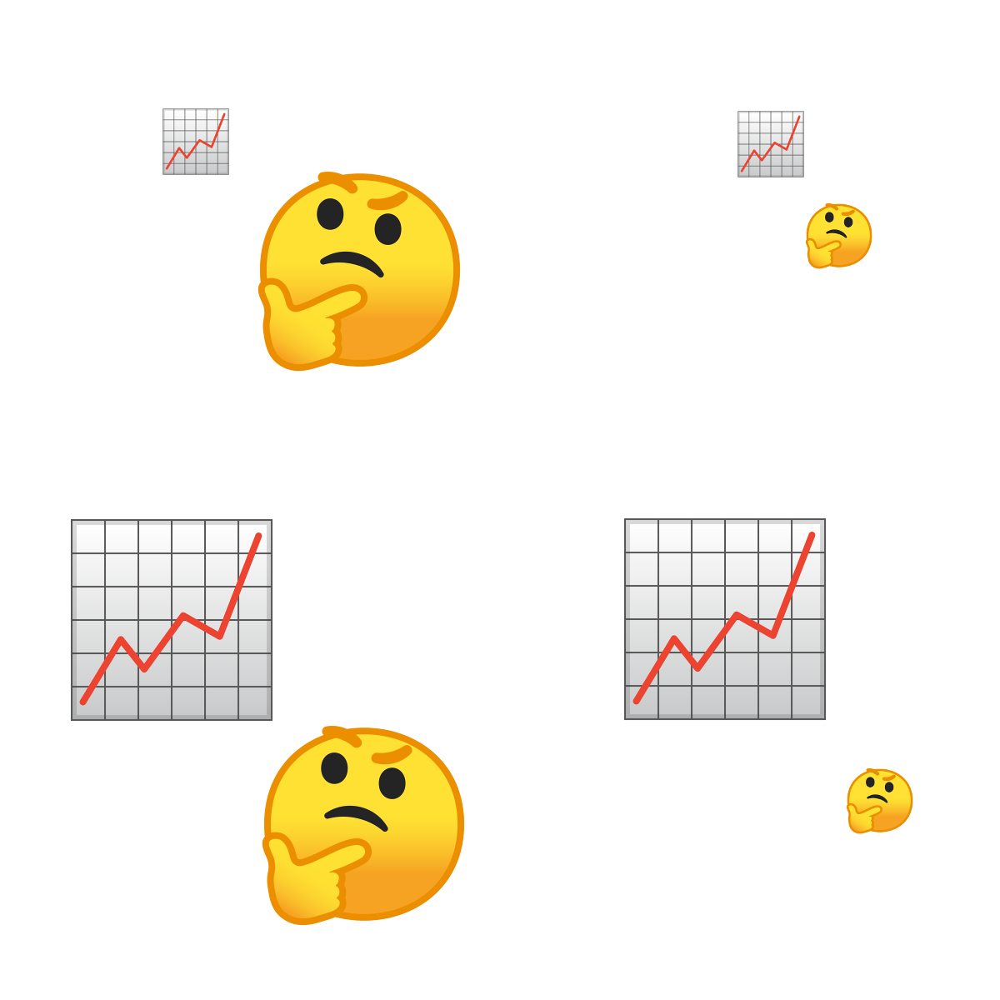
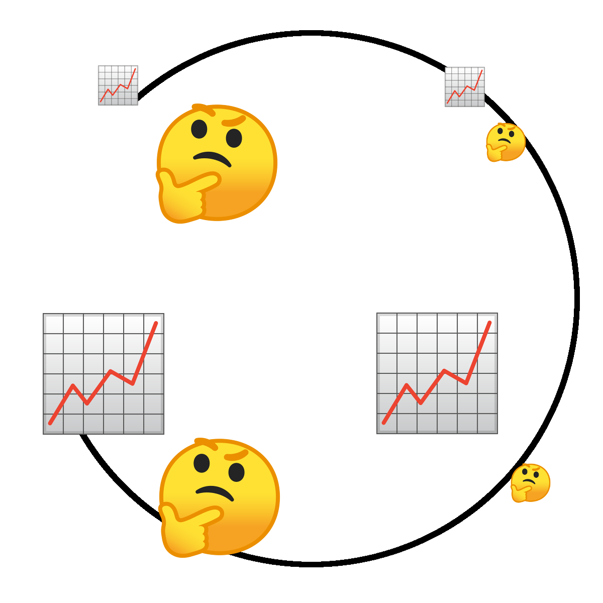
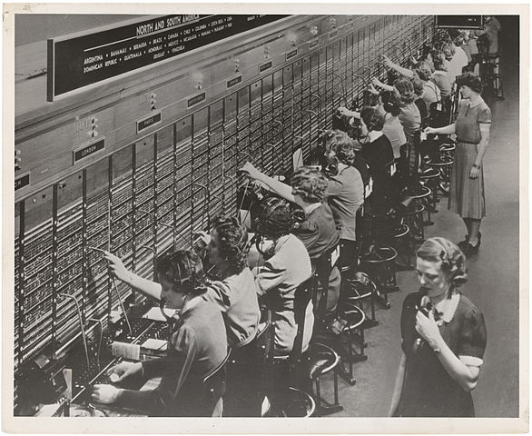

class: inverse, center, middle

# {Big|small} data, {big|small} theory?

### Some thoughts on the past, present and future of language dynamics

.medium[Henri Kauhanen

Jour Fixe 5 Nov 2019 // Zukunftskolleg // U. Konstanz]

---

### Why does a single species speak around **7,000** distinct languages?
### Why do all these languages have **dialects**?
### Why did English look like this **1,000 years ago**?

.medlite[
Eac swylce seo næddre wæs geapre ðonne ealle ða oðre nytenu ðe God geworhte ofer eorðan. Ond seo næddre cwæð to ðam wife: Hwi forbead God eow ðæt ge ne æton of ælcon treowe binnan Paradisum?]

### When a language changes, what does the **trajectory** look like?
### How do linguistic innovations **spread** through populations of speakers?


---

```{r echo=FALSE,out.width='100%',fig.align='center'}

```

---

# {Big|small} data, {big|small} theory

```{r echo=FALSE,out.width='60%',fig.align='center'}

```

---

# {Big|small} data, {big|small} theory

```{r echo=FALSE,out.width='60%',fig.align='center'}

```

---

# Small data, big theory

"... I consider it demonstrated that the Germanic Sound Shift was caused by people's moving into a mountainous region ..."<sup>1</sup>

"... After a long and careful analysis the Hopi language is seen to contain no words, grammatical forms, constructions or expressions that refer directly to what we call 'time', or to past, present or future ..."<sup>2</sup>

"... I am talking about the possible causes of the exaggerated evolution of Andalusian phonetics, making note of the most convincing and most accepted (though by no means only) explanation: the articulatory laziness of Andalusian man, perhaps resulting from the climate or from psychology ..."<sup>3</sup>

.footnote[
<sup>1</sup>Meyer, H. *Zeitschrift für deutsches Altertum und deutsche Literatur* 45:101–128 (1901), p. 122, translation mine.

<sup>2</sup>Whorf, B. L. in *Language, Thought and Reality* (ed. J. B. Carroll), 57–64 (1956), p. 57.

<sup>3</sup>Llorente Maldonado de Guevara, A., *Revista de Filología Española*, 45:227–240 (1962), p. 230, translation mine.]

---

.pull-left[
# More constrained theory...

A language is a set of **parameters** &pi; which can be switched on or off<sup>1</sup>

* e.g. word order can be VO or OV

On the population level, and possibly also on an individual level, parameter &pi; is expressed with probability P(&pi;)

When a language changes, P(&pi;) goes from 0 to 1 (or from 1 to 0), usually along a more or less smooth **S-curve**
]

.pull-right[
```{r echo=FALSE,out.width='90%',fig.align='center'}

```

```{r echo=FALSE,message=FALSE,warning=FALSE,dev='png',fig.height=5,out.width='90%',fig.align='center'}
require(ggplot2)
df <- data.frame(time=seq(from=1400, to=1800, by=1), frequency=hipster::logistic(t=seq(from=1400, to=1800, by=1), k=1600, s=0.04))
g <- ggplot(df, aes(x=time, y=frequency)) + geom_line(lwd=1.5)
g <- g + ylab(expression(P(pi)))
g <- g + theme(text=element_text(size=30))
print(g)
```
]

.footnote[
<sup>1</sup>Chomsky, N. & Lasnik, H. in *Syntax: an international handbook of contemporary research* (ed. J. Jacobs et al.), vol. 1, 506–569 (1993), *inter alios*.]

---

.pull-left[
### Constant Rate Hypothesis<sup>1</sup>

.medlite[
**If** a parameter &pi; changes in the language...

**and** individual changes C<sub>1</sub>, ... , C<sub>n</sub> are all coupled to &pi;...

**then** C<sub>1</sub>, ... , C<sub>n</sub> should manifest as parallel S-curves]

```{r echo=FALSE,message=FALSE,warning=FALSE,dev='png',fig.height=5,out.width='90%',fig.align='center'}
require(ggplot2)
df <- expand.grid(time=seq(from=1400, to=1800, by=1), context=c(1,2,3), frequency=NA)
k <- c(1550, 1600, 1650)
df$frequency <- hipster::logistic(t=df$time, k=k[df$context], s=0.04)
g <- ggplot(df, aes(x=time, y=frequency, color=factor(context))) + geom_line(lwd=1.5) + scale_colour_brewer(palette="Set1", name=expression(C[i]))
g <- g + ylab(expression(P(pi)))
g <- g + theme(text=element_text(size=30))
print(g)
```
]

--

.pull-right[
### Variable Rate Hypothesis

.medlite[
Each C<sub>i</sub> is free to develop on its own (is, in effect, its own parameter)

**&rarr;** Not necessarily parallel S-curves
]

```{r echo=FALSE,message=FALSE,warning=FALSE,dev='png',fig.height=5,out.width='90%',fig.align='center'}
require(ggplot2)
df <- expand.grid(time=seq(from=1400, to=1800, by=1), context=c(1,2,3), frequency=NA)
k <- c(1550, 1600, 1650)
s <- c(0.04, 0.03, 0.02)
df$frequency <- hipster::logistic(t=df$time, k=k[df$context], s=s[df$context])
g <- ggplot(df, aes(x=time, y=frequency, color=factor(context))) + geom_line(lwd=1.5) + scale_colour_brewer(palette="Set1", name=expression(C[i]))
g <- g + ylab(expression(P(pi)))
g <- g + theme(text=element_text(size=30))
print(g)
```

.footnote[
<sup>1</sup>Kroch, A. S. *Language Variation and Change* 1:199–244 (1989).]
]

---

## Small theory, small data...

### *be like* vs. other quotatives in AAVE<sup>1</sup>

```{r echo=FALSE,message=FALSE,warning=FALSE,dev='png',fig.height=3.5,fig.retina=3,out.width='100%',fig.align='center'}
require(ggplot2)
df <- cre::prepare_data(read.csv("springville_belike_person.csv"), format="wide")
df$context <- ifelse(df$context == "X1st.person", "1st person", df$context)
df$context <- ifelse(df$context == "X3rd.person", "3rd person", df$context)
g <- ggplot(df, aes(x=date, y=frequency, color=context)) + geom_point() + scale_colour_brewer(palette="Set1")
g <- g + theme(text=element_text(size=15))
g <- g + ylim(0,1) + ylab("freq. be like") + xlab("birth year")
print(g)
```

.footnote[
<sup>1</sup>Cukor-Avila, P. *American Speech* 77:3–31 (2002).]

---

## Small theory, small data...

### *be like* vs. other quotatives in AAVE<sup>1</sup>

```{r echo=FALSE,message=FALSE,warning=FALSE,dev='png',fig.height=3.5,fig.retina=3,out.width='100%',fig.align='center'}
require(ggplot2)
df <- cre::prepare_data(read.csv("springville_belike_person.csv"), format="wide")
df$context <- ifelse(df$context == "X1st.person", "1st person", df$context)
df$context <- ifelse(df$context == "X3rd.person", "3rd person", df$context)

mod <- cre::fit.cre.nls(data=df, format="long", model="VRE", budget=100)

mdf <- expand.grid(time=seq(from=min(df$date), to=max(df$date), length.out=100), context=c(1,2), frequency=NA)
k <- mod$parameters[mod$parameters$parameter=="k", ]$value
s <- mod$parameters[mod$parameters$parameter=="s", ]$value
mdf$frequency <- hipster::logistic(t=mdf$time, k=k[mdf$context], s=s[mdf$context])
mdf$context <- ifelse(mdf$context == 1, "1st person", mdf$context)
mdf$context <- ifelse(mdf$context == 2, "3rd person", mdf$context)

g <- ggplot(df, aes(x=date, y=frequency, color=context)) + geom_point() + scale_colour_brewer(palette="Set1")
g <- g + theme(text=element_text(size=15))
g <- g + ylim(0,1) + ylab("freq. be like") + xlab("birth year")
g <- g + geom_line(data=mdf, aes(x=time, y=frequency, color=context))
print(g)
```

.footnote[
<sup>1</sup>Cukor-Avila, P. *American Speech* 77:3–31 (2002).]

---

## Small theory, small data...

### *be like* vs. other quotatives in AAVE<sup>1</sup>

```{r echo=FALSE,message=FALSE,warning=FALSE,dev='png',fig.height=3.5,fig.retina=3,out.width='100%',fig.align='center'}
require(ggplot2)
df <- cre::prepare_data(read.csv("springville_belike_person.csv"), format="wide")
df$context <- ifelse(df$context == "X1st.person", "1st person", df$context)
df$context <- ifelse(df$context == "X3rd.person", "3rd person", df$context)

mod <- cre::fit.cre.nls(data=df, format="long", model="VRE", budget=100)

mdf <- expand.grid(time=seq(from=1980, to=2020, length.out=100), context=c(1,2), frequency=NA)
k <- mod$parameters[mod$parameters$parameter=="k", ]$value
s <- mod$parameters[mod$parameters$parameter=="s", ]$value
mdf$frequency <- hipster::logistic(t=mdf$time, k=k[mdf$context], s=s[mdf$context])
mdf$context <- ifelse(mdf$context == 1, "1st person", mdf$context)
mdf$context <- ifelse(mdf$context == 2, "3rd person", mdf$context)

g <- ggplot(df, aes(x=date, y=frequency, color=context)) + geom_point() + scale_colour_brewer(palette="Set1")
g <- g + theme(text=element_text(size=15))
g <- g + ylim(0,1) + ylab("freq. be like") + xlab("birth year")
g <- g + geom_line(data=mdf, aes(x=time, y=frequency, color=context))
print(g)
```

.footnote[
<sup>1</sup>Cukor-Avila, P. *American Speech* 77:3–31 (2002).]

---

# How to decide?

We<sup>1</sup> surveyed 39 studies on the Constant Rate Hypothesis

26 of these simply eyeballed the curves

13 employed one (or more) of 4 available quantitative statistical methods

.medlite[
However, each of these methods relies on falling back on a null hypothesis of a constant rate. In other words, we proclaim a constant rate **if we fail to show a variable rate**.
]

This invites a type II error of unknown probability...

.medlite[
**&rarr;** Conduct a **power analysis** to find out how likely our decisions are to be wrong
]

.footnote[
<sup>1</sup>Kauhanen, H. & Walkden, G. "On the proper treatment of constant rate effects". Ms.]

---

# Power analysis

```{r echo=FALSE,message=FALSE,warning=FALSE,dev='png',fig.height=4.0,fig.retina=3,out.width='100%',fig.align='center'}
load("../Rsession/.RData")
require(viridis)
df <- results$alphabeta$classical
df <- df[df$TP + df$FN == 100, ]
df <- df[df$method %in% c("M4", "M5", "M6", "M7"), ]
df <- df[df$L == 2 & df$alpha_crit == 0.05, ]
df <- df[!is.na(df$method) & !is.na(df$E), ] 
df$E <- round(df$E, 2)
g <- ggplot(df, aes(x=factor(H), y=factor(V), fill=beta)) + geom_raster() + scale_fill_viridis(option="viridis", direction=-1, limits=c(0,1), name=expression("type II error rate"~beta~"  ")) + facet_grid(method~E, as.table=TRUE) + xlab(expression("horizontal resolution"~italic(H))) + ylab(expression("vertical resolution"~italic(V)))
g <- g + theme_minimal() + theme(axis.text.x=element_text(angle=60, vjust=0.5, size=4, color="black"), axis.text.y=element_text(size=4, color="black"), legend.position="top")
print(g)
```

---

# Power analysis

```{r echo=FALSE,message=FALSE,warning=FALSE,dev='png',fig.height=4.0,fig.retina=3,out.width='100%',fig.align='center'}
load("../Rsession/.RData")
source("../Rsession/closest_in_vector.R")
require(viridis)
df <- results$alphabeta$classical
df <- df[df$TP + df$FN == 100, ]
df <- df[df$method %in% c("M4", "M5", "M6", "M7"), ]
df <- df[df$L == 2 & df$alpha_crit == 0.05, ]
df <- df[!is.na(df$method) & !is.na(df$E), ] 
df$E <- round(df$E, 2)
g <- ggplot(df, aes(x=factor(H), y=factor(V), fill=beta)) + geom_raster() + scale_fill_viridis(option="viridis", direction=-1, limits=c(0,1), name=expression("type II error rate"~beta~"  ")) + facet_grid(method~E, as.table=TRUE) + xlab(expression("horizontal resolution"~italic(H))) + ylab(expression("vertical resolution"~italic(V)))
g <- g + theme_minimal() + theme(axis.text.x=element_text(angle=60, vjust=0.5, size=4, color="black"), axis.text.y=element_text(size=4, color="black"), legend.position="top")

catu <- catalogue[catalogue$Original.method != "N/A", ]
cat <- NULL
for (metu in c("M4", "M5", "M6", "M7")) {
  thiscatu <- catu
  thiscatu$method <- metu
  cat <- rbind(cat, thiscatu)
}
cat <- catu
cat$L <- 2
cat$generator <- "VRE"
cat$TP <- 0
cat$FP <- 0
cat$TN <- 0
cat$FN <- 0
cat$alpha_crit <- 0.05
cat$alpha <- 0
cat$beta <- 0
cat$E <- NA
for (i in 1:nrow(cat)) {
cat[i,]$V <- closest_in_vector(x=cat[i,]$V, vec=unique(df$V), k=1)$vec
cat[i,]$H <- closest_in_vector(x=cat[i,]$H, vec=unique(df$H), k=1)$vec
cat[i,]$E <- closest_in_vector(x=empslopes[empslopes$ID==cat[i,]$ID, ]$E, vec=unique(df$E), k=1)$vec
}
cat <- cat[cat$Type=="CRE", ]
cat <- cat[!(cat$ID %in% c(27, 29, 30)), ]
g <- g + geom_text(data=cat, aes(x=factor(H), y=factor(V), label="x"), color="red")

print(g)
```

---

# Big(ger) data to the rescue?

### *have* with *do*-support in American English<sup>1</sup>

```{r echo=FALSE,message=FALSE,warning=FALSE,dev='png',fig.height=3.5,fig.retina=3,out.width='100%',fig.align='center'}
require(ggplot2)
df <- cre::prepare_data(read.csv("zimmermann_noadjuncts.csv"), format="wide")
#df$context <- ifelse(df$context == "X1st.person", "1st person", df$context)
#df$context <- ifelse(df$context == "X3rd.person", "3rd person", df$context)
g <- ggplot(df, aes(x=date, y=frequency, color=context)) + geom_point() + scale_colour_brewer(palette="Set1")
g <- g + theme(text=element_text(size=15))
g <- g + ylim(0,1) + ylab("freq. do-support") + xlab("year")
print(g)
```

.footnote[
<sup>1</sup>Zimmermann, R. *Formal and quantitative approaches to the study of syntactic change*, U. Geneva PhD thesis (2017).]

---

## Well, not really...

ICBS that

$$HV \sim E^{-\ell}$$

for a constant $\ell > 0$.

.medlite[
N.B. As $E \to 0$, RHS $\to \infty$.

**&rarr;** For any arbitrarily high data resolution $HV$, there is a small Variable Rate Effect that goes unnoticed.]

This is not surprising: note that CREs are the $E=0$ limiting case of VREs!

---

.pull-left[
### Constant Rate Hypothesis

.medlite[
**If** a parameter &pi; changes in the language...

**and** individual changes C<sub>1</sub>, ... , C<sub>n</sub> are all coupled to &pi;...

**then** C<sub>1</sub>, ... , C<sub>n</sub> should manifest as parallel S-curves]

```{r echo=FALSE,message=FALSE,warning=FALSE,dev='png',fig.height=5,out.width='90%',fig.align='center'}
require(ggplot2)
df <- expand.grid(time=seq(from=1400, to=1800, by=1), context=c(1,2,3), frequency=NA)
k <- c(1550, 1600, 1650)
df$frequency <- hipster::logistic(t=df$time, k=k[df$context], s=0.04)
g <- ggplot(df, aes(x=time, y=frequency, color=factor(context))) + geom_line(lwd=1.5) + scale_colour_brewer(palette="Set1", name=expression(C[i]))
g <- g + ylab(expression(P(pi)))
g <- g + theme(text=element_text(size=30))
print(g)
```
]

--

.pull-right[
### Constant Rate Hypothesis 2.0<sup>1</sup>

.medlite[
A model of language acquisition

**plus** a model of language use

**derive** the curves:
]

```{r echo=FALSE,message=FALSE,warning=FALSE,dev='png',fig.height=5,out.width='90%',fig.align='center'}
require(ggplot2)
require(hipster)
df <- expand.grid(time=seq(from=1400, to=1800, by=1), context=c(1,2,3), frequency=NA)
s <- 0.025
k <- 1600
b <- c(-0.8, 0, 1)
df$frequency <- logistic(t=df$time, k=k, s=s) + b[df$context]*logistic(t=df$time, k=k, s=s)*(1 - logistic(t=df$time, k=k, s=s))
g <- ggplot(df, aes(x=time, y=frequency, color=factor(context))) + geom_line(lwd=1.5) + scale_colour_brewer(palette="Set1", name=expression(C[i]))
g <- g + ylab(expression(P(pi)))
g <- g + theme(text=element_text(size=30))
print(g)
```

.footnote[
<sup>1</sup>Kauhanen, H. & Walkden, G. *Nat. Lang. Linguist. Theory* 36:483–521 (2018).]
]

---

# Evaluation (1)

.pull-left[
Use the Parametric Bootstrap Cross-fitting Method (PBCM)<sup>1</sup> to compare the two models:

1. Fit 1: **CRH vs. VRH** and **CRH2.0 vs. VRH** to the 39 datasets
2. Pick those datasets where either CRH or CRH2.0 is selected **and** the type I and type II error rates are low (there are 5 such datasets)
3. Fit 2: **CRH vs. CRH2.0** on these 5 datasets

.footnote[
<sup>1</sup>Wagenmakers, E.-J. et al. *Journal of Mathematical Psychology* 48:28–50 (2014).]
]

--

.pull-right[
.medlite[
**Result:** In 3 out of 5 cases, CRH2.0 is preferred over CRH.]
]

---

.pull-left[
# Evaluation (2)

CRH2.0 makes a prediction CRH doesn't: that the **time separation** between any two coupled changes has a finite upper bound<sup>1</sup>

```{r echo=FALSE,message=FALSE,warning=FALSE,dev='png',fig.height=4.5,out.width='70%',fig.align='center'}
require(ggplot2)
require(hipster)
df <- expand.grid(time=seq(from=1400, to=1800, by=1), context=c(1,2,3), frequency=NA)
s <- 0.025
k <- 1600
b <- c(-0.8, 0, 1)
df$frequency <- logistic(t=df$time, k=k, s=s) + b[df$context]*logistic(t=df$time, k=k, s=s)*(1 - logistic(t=df$time, k=k, s=s))
g <- ggplot(df, aes(x=time, y=frequency, color=factor(context))) + geom_line(lwd=1.5) + scale_colour_brewer(palette="Set1", name=expression(C[i]))
g <- g + ylab(expression(P(pi)))
g <- g + theme(text=element_text(size=30))
print(g)
```

Let's see if the empirical time separations are contained within the prediction...

.footnote[
<sup>1</sup>Kauhanen, H. & Walkden, G. *Nat. Lang. Linguist. Theory* 36:483–521 (2018), Theorem 4.]
]

--

.pull-right[
**Result:**

```{r echo=FALSE,message=FALSE,warning=FALSE,dev='png',fig.height=10,fig.retina=3,out.width='100%',fig.align='center'}
require(ggplot2)
load("../Rsession/.RData")
timeseps2 <- timeseps
#timeseps2 <- timeseps2[order(timeseps2$maxsep), ]
timeseps2$ID <- 1:nrow(timeseps2)
g <- ggplot(timeseps2, aes(y=factor(ID), x=empsep)) + geom_point(size=3) + geom_segment(data=timeseps2, aes(y=factor(ID), yend=factor(ID), x=minsep, xend=maxsep, color=type), lwd=2.5, alpha=0.5) + ylab("dataset") + xlab("time separation (years)")
g <- g + theme(text=element_text(size=24), legend.position="top")
g <- g + theme(axis.text.y=element_text(size=12, color="black"), axis.text.x=element_text(size=16, color="black"))
g <- g + scale_colour_brewer(palette="Set1", name="")
print(g)
```
]

---

# Lessons learned

* Unconstrained big theory is bad (not a surprise...)
* But small theory may not be enough even when combined with big data (maybe a surprise)
* Intuitions can be deceptive – CRH2.0 does **not** predict constant rates (definitely surprising)
* But it **does** lead to empirical predictions (mathematically derivable from first principles):
  * in a "Constant" Rate Effect, rates are bound together by a certain mathematical relationship
  * in a "Constant" Rate Effect, the temporal translation between changes has an upper limit
* (Variable Rate Effects are not constrained by either of the above)
* We need **mechanistic models**<sup>1</sup> – models that predict and explain – big theory in the good sense of the word

.footnote[
<sup>1</sup>Craver, C. F. *Synthese* 153:355–376 (2006).]

---

## PopDyLan: Population Dynamics of Language

* Goal of the project: to take mathematical/computational models of language change to a new level of realism
* Tools: network science, computational simulations
* Questions: How do existing models behave when run on realistic social structures?
  * finite, structured populations
  * evolving (dynamic) populations
  * populations in contact
* Output (aside publications): an open-source C++ library of routines for realistic simulation of language dynamics

--

.hilite[
Thank you for your attention! Papers available at http://henr.in.]
