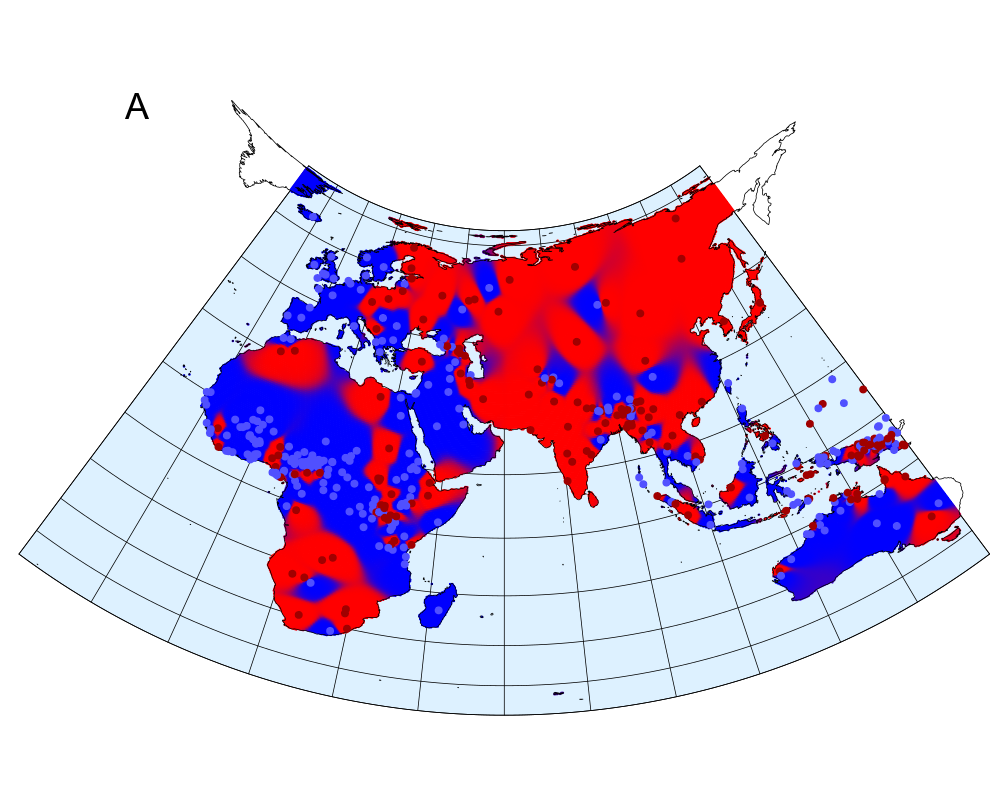
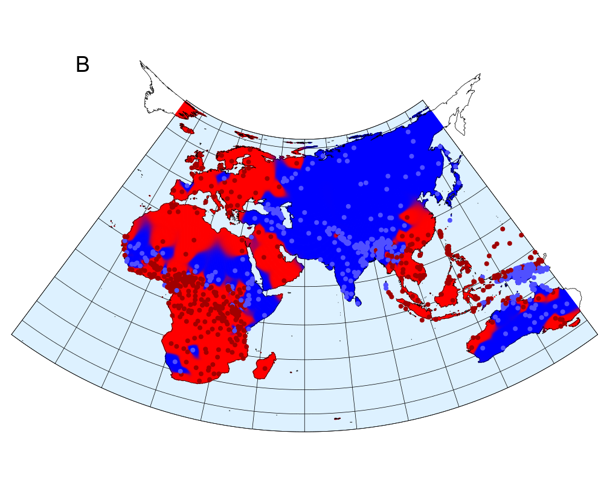
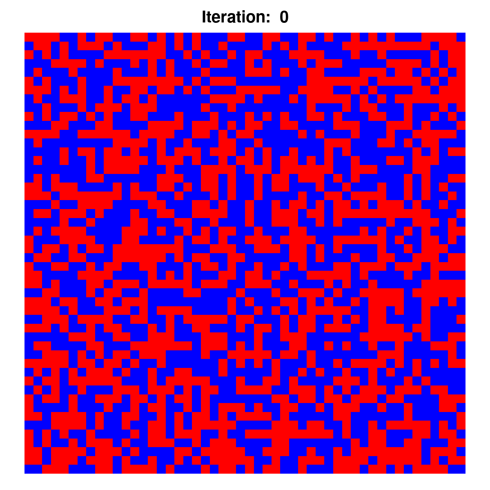
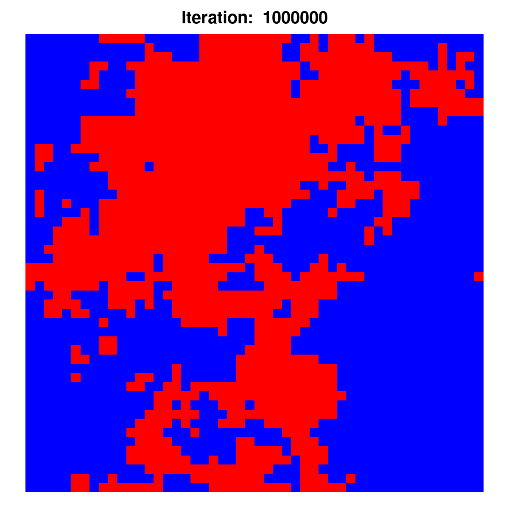

```{r,echo=FALSE}
require(cre)
require(ggplot2)
require(stringr)
knitr::opts_chunk$set(dpi=300,out.height=400,out.width=600,fig.height=3.0,fig.width=4.5)

as.year <- function(x) {
  x <- as.Date(x, origin="1970-01-01")
  x <- str_extract(x, pattern="^[^-]*")
  as.numeric(x)
}

logistic <- function(x, s, k) {
  1/(1 + exp(-s*(x - k)))
}
```

# What is Language Change?

> and ne gelæde þu us on costnunge, ac alys us of yfle (~990)

--

> and lede vs not in to temptacioun, but delyuere vs fro yuel (~1390)

--

> and lead vs not into temptation, but deliuer vs from euill (~1610)

--

> and do not bring us into temptation, but deliver us from the evil one (2017)

--

## What's changed?

* Vocabulary
* Spelling
* Syntax (word order)
* Morphology (form of words)
* Phonology (sounds)

---

# What is Language Change?

> and ne gelæde þu us on costnunge, ac alys us of yfle (~990)

> and lede vs not in to temptacioun, but delyuere vs fro yuel (~1390)

> and lead vs not into temptation, but deliuer vs from euill (~1610)

> and do not bring us into temptation, but deliver us from the evil one (2017)

## Why did it change?

* Language contact
* Sociological reasons
* Linguistic "chain reactions"
* Random drift

---

# What is Speed?

Several notions of "(speed of) change" in linguistics:
* Diffusion through a lexicon
* Diffusion through dialects
* Areal diffusion

--

.hilite[
The relevant notion here is diffusion of a single linguistic change through a population (speech community)]

* Changes begin with a few innovative speakers, then spread
* First attempt at definition: Suppose at $t_0$ 1% of the population has undergone the change and at $t_1$, 99% of the population have. Then the speed of change $s$ is

$$s \propto \frac{1}{t_1 - t_0}$$

---

# The Historical (& Contemporary) Record

Research on language change draws on various types of data source:

* Diachronic corpora .large[ ✍️ 📜 🖋️ 📖]
* Apparent-time datasets .large[ 👵 👩 👧 👶]
* Educated guesses and reconstructions .large[ 🤔 🏗️]
--

* Inference from spatial data .large[ 🗺️]  **NEW!** 😮

---

# Bad Data, Worse Data, Historical Linguistics?

.hilite[
It's fair to say: historical linguistics contends with a severe **"bad data problem"**]

Estimates of relevant quantities are imprecise over several dimensions simultaneously:

* **When** exactly was the document written? .large[ 🗓️]
* **Who** exactly wrote it? .large[ 👽]
* **Where** exactly was it written? .large[ 🌍]
* How **representative** is it of the community norm at the time? .large[ 👨‍👩‍👧‍👦]
* Is the document's language **register**-specific? .large[ ⛪]

---

class: center

## "I know not" vs. "I do not know"<sup>\*</sup>

```{r,echo=FALSE}
df <- read.csv("data/kroch_do.csv")
df <- prepare_data(df, format="wide")
df$date_dfo <- as.year(df$date_dfo)
df <- df[df$context=="negative.declaratives", ]
minx <- min(df$date_dfo)
maxx <- max(df$date_dfo)
df <- df[df$date_dfo < 1550, ]
g <- ggplot(df, aes(x=date_dfo, y=frequency))
g <- g + geom_point(color="blue")
g <- g + ylim(0,1) + theme_bw()
g <- g + xlim(minx, maxx)
g <- g + xlab("year") + ylab("relative frequency of innovation")
print(g)
```

.footnote[
\*) Data from: Kroch, A. S. 1989. Reflexes of grammar in patterns of language change. *Language Variation and Change* 1: 199–244.
]

---

class: center

## "I know not" vs. "I do not know"<sup>\*</sup>

```{r,echo=FALSE}
df <- read.csv("data/kroch_do.csv")
df <- prepare_data(df, format="wide")
df$date_dfo <- as.year(df$date_dfo)
df <- df[df$context=="negative.declaratives", ]
minx <- min(df$date_dfo)
maxx <- max(df$date_dfo)
df <- df[df$date_dfo < 1550, ]
mod <- nls(frequency~logistic(x=date_dfo, s=s, k=k), df, start=list(s=0.01, k=1550))
s <- as.numeric(coef(mod)[1])
k <- as.numeric(coef(mod)[2])
seku <- seq(from=minx, to=maxx, length.out=100)
df2 <- data.frame(year=seku, freq=logistic(x=seku, s=s, k=k))
g <- ggplot(df, aes(x=date_dfo, y=frequency))
g <- g + geom_point(color="blue")
g <- g + ylim(0,1) + theme_bw()
g <- g + xlim(minx, maxx)
g <- g + xlab("year") + ylab("relative frequency of innovation")
g <- g + geom_line(data=df2, aes(x=year, y=freq), color="blue")
print(g)
```

.footnote[
\*) Data from: Kroch, A. S. 1989. Reflexes of grammar in patterns of language change. *Language Variation and Change* 1: 199–244.
]

---

class: center

## "I know not" vs. "I do not know"<sup>\*</sup>

```{r,echo=FALSE}
df <- read.csv("data/kroch_do.csv")
df <- prepare_data(df, format="wide")
df$date_dfo <- as.year(df$date_dfo)
df <- df[df$context=="negative.declaratives", ]
minx <- min(df$date_dfo)
maxx <- max(df$date_dfo)
df3 <- df[df$date_dfo < 1550, ]
mod <- nls(frequency~logistic(x=date_dfo, s=s, k=k), df3, start=list(s=0.01, k=1550))
s <- as.numeric(coef(mod)[1])
k <- as.numeric(coef(mod)[2])
seku <- seq(from=minx, to=maxx, length.out=100)
df2 <- data.frame(year=seku, freq=logistic(x=seku, s=s, k=k))
g <- ggplot(df, aes(x=date_dfo, y=frequency))
g <- g + geom_point(color="blue")
g <- g + ylim(0,1) + theme_bw()
g <- g + xlim(minx, maxx)
g <- g + xlab("year") + ylab("relative frequency of innovation")
g <- g + geom_line(data=df2, aes(x=year, y=freq), color="blue")
print(g)
```

.footnote[
\*) Data from: Kroch, A. S. 1989. Reflexes of grammar in patterns of language change. *Language Variation and Change* 1: 199–244.
]

---

class: center

## "I know not" vs. "I do not know"<sup>\*</sup>

```{r,echo=FALSE}
df <- read.csv("data/kroch_do.csv")
df <- prepare_data(df, format="wide")
df$date_dfo <- as.year(df$date_dfo)
df <- df[df$context=="negative.declaratives", ]
minx <- min(df$date_dfo)
maxx <- max(df$date_dfo)
#df3 <- df[df$date_dfo < 1550, ]
mod <- nls(frequency~logistic(x=date_dfo, s=s, k=k), df, start=list(s=0.01, k=1550))
s <- as.numeric(coef(mod)[1])
k <- as.numeric(coef(mod)[2])
seku <- seq(from=minx, to=maxx, length.out=100)
df2 <- data.frame(year=seku, freq=logistic(x=seku, s=s, k=k))
g <- ggplot(df, aes(x=date_dfo, y=frequency))
g <- g + geom_point(color="blue")
g <- g + ylim(0,1) + theme_bw()
g <- g + xlim(minx, maxx)
g <- g + xlab("year") + ylab("relative frequency of innovation")
g <- g + geom_line(data=df2, aes(x=year, y=freq), color="blue")
print(g)
```

.footnote[
\*) Data from: Kroch, A. S. 1989. Reflexes of grammar in patterns of language change. *Language Variation and Change* 1: 199–244.
]

---

class: center

## "I know not" vs. "I do not know"<sup>\*</sup>

```{r,echo=FALSE,warning=FALSE}
df <- read.csv("data/kroch_do.csv")
df <- prepare_data(df, format="wide")
df$date_dfo <- as.year(df$date_dfo)
df <- df[df$context=="negative.declaratives", ]
minx <- min(df$date_dfo)
maxx <- max(df$date_dfo)
g <- ggplot(df, aes(x=date_dfo, y=frequency))
g <- g + geom_point(color="blue")
g <- g + ylim(0,1) + theme_bw()
g <- g + xlim(minx, maxx)
g <- g + xlab("year") + ylab("relative frequency of innovation")
g <- g + geom_smooth(method="loess", se=FALSE, color="blue", lwd=0.5)
print(g)
```

.footnote[
\*) Data from: Kroch, A. S. 1989. Reflexes of grammar in patterns of language change. *Language Variation and Change* 1: 199–244.
]

---

class: center

## "I not know" vs. "I not know not"<sup>\*</sup>

```{r,echo=FALSE}
df <- read.csv("data/wallage_1vs2_discourse.csv")
df <- prepare_data(df, format="wide")
df$date_dfo <- as.year(df$date_dfo)
df <- df[df$context=="discourse.new", ]
minx <- min(df$date_dfo)
maxx <- max(df$date_dfo)
g <- ggplot(df, aes(x=date_dfo, y=1-frequency))
g <- g + geom_point(color="blue")
g <- g + ylim(0,1) + theme_bw()
g <- g + xlim(minx, maxx)
g <- g + xlab("year") + ylab("relative frequency of innovation")
print(g)
```

.footnote[
\*) Data from: Wallage, P. 2013. Functional differentiation and grammatical competition in the English Jespersen Cycle. *Journal of Historical Syntax* 2: 1–25.
]

---

class: center

## "I not know" vs. "I not know not"<sup>\*</sup>

```{r,echo=FALSE}
df <- read.csv("data/wallage_1vs2_discourse.csv")
df <- prepare_data(df, format="wide")
df$date_dfo <- as.year(df$date_dfo)
df <- df[df$context=="discourse.new", ]
minx <- min(df$date_dfo)
maxx <- max(df$date_dfo)
mod <- nls(frequency~logistic(x=date_dfo, s=s, k=k), df, start=list(s=-0.01, k=1250))
s <- as.numeric(coef(mod)[1])
k <- as.numeric(coef(mod)[2])
seku <- seq(from=minx, to=maxx, length.out=100)
df2 <- data.frame(year=seku, freq=logistic(x=seku, s=s, k=k))
g <- ggplot(df, aes(x=date_dfo, y=1-frequency))
g <- g + geom_point(color="blue")
g <- g + ylim(0,1) + theme_bw()
g <- g + xlim(minx, maxx)
g <- g + xlab("year") + ylab("relative frequency of innovation")
g <- g + geom_line(data=df2, aes(x=year, y=1-freq), color="blue")
print(g)
```

.footnote[
\*) Data from: Wallage, P. 2013. Functional differentiation and grammatical competition in the English Jespersen Cycle. *Journal of Historical Syntax* 2: 1–25.
]

---

class: center

## "I not know" vs. "I not know not"<sup>\*</sup>

```{r,echo=FALSE}
df <- read.csv("data/wallage_1vs2_discourse.csv")
df <- prepare_data(df, format="wide")
df$date_dfo <- as.year(df$date_dfo)
df <- df[df$context=="discourse.new", ]
minx <- min(df$date_dfo)
maxx <- max(df$date_dfo)
mod <- nls(frequency~logistic(x=date_dfo, s=s, k=k), df, start=list(s=-0.01, k=1250))
s <- as.numeric(coef(mod)[1])
k <- as.numeric(coef(mod)[2])
seku <- seq(from=minx, to=maxx, length.out=100)
df2 <- data.frame(year=seku, freq=0.5 + 0.5*sin(0.09*seku + 50))
g <- ggplot(df, aes(x=date_dfo, y=1-frequency))
g <- g + geom_point(color="blue")
g <- g + ylim(0,1) + theme_bw()
g <- g + xlim(minx, maxx)
g <- g + xlab("year") + ylab("relative frequency of innovation")
g <- g + geom_line(data=df2, aes(x=year, y=1-freq), color="blue")
print(g)
```

.footnote[
\*) Data from: Wallage, P. 2013. Functional differentiation and grammatical competition in the English Jespersen Cycle. *Journal of Historical Syntax* 2: 1–25.
]

---

class: center

## "I haven't a clue" vs. "I don't have a clue"<sup>\*</sup>

```{r,echo=FALSE}
df <- read.csv("data/zimmermann.csv")
df <- prepare_data(df, format="wide")
df$date_dfo <- as.year(df$date_dfo)
df <- df[df$context=="inversion", ]
minx <- min(df$date_dfo)
maxx <- max(df$date_dfo)
g <- ggplot(df, aes(x=date_dfo, y=frequency))
g <- g + geom_point(color="blue")
g <- g + ylim(0,1) + theme_bw()
g <- g + xlim(minx, maxx)
g <- g + xlab("year") + ylab("relative frequency of innovation")
print(g)
```

.footnote[
\*) Data from: Zimmermann, R. 2017. *Formal and quantitative approaches to the study of syntactic change: three case studies from the history of English.* PhD thesis, University of Geneva.
]

---


class: center, middle, inverse

# Work in Progress \#1

## The Constant Rate Effect

### in collaboration with George Walkden (Konstanz)

---

# The Constant Rate Effect (CRE)

When an innovation replaces an older form across a set of linguistic contexts, the rate of replacement is the same in all contexts.<sup>\*</sup> Like so:<sup>\*\*</sup>

```{r,echo=FALSE,out.height=300,out.width=450}
df <- read.csv("data/zimmermann.csv")
df <- prepare_data(df, format="wide")
df$date_dfo <- as.year(df$date_dfo)
#df <- df[df$context=="inversion", ]
minx <- min(df$date_dfo)
maxx <- max(df$date_dfo)
g <- ggplot(df, aes(x=date_dfo, y=frequency, color=context))
g <- g + geom_point(alpha=0.8)
g <- g + ylim(0,1) + theme_bw()
g <- g + xlim(minx, maxx)
g <- g + xlab("year") + ylab("relative frequency of innovation")
print(g)
```

.footnote[
\*) Kroch, A. S. 1989. Reflexes of grammar in patterns of language change. *Language Variation and Change* 1: 199–244.

\*\*) Zimmermann, R. 2017. *Formal and quantitative approaches to the study of syntactic change: three case studies from the history of English.* PhD thesis, University of Geneva.
]

---

# A Model of CREs

In previous work, HK+GW presented a mathematical model of the CRE.

A simplified version of the model predicts trajectories as follows:

$$p_i(t) = \sigma_{s,k}(t) + b_i \sigma_{s,k}(t) \left(1 - \sigma_{s,k}(t)\right)$$

where $\sigma_{s,k}(t) = 1/\left(1 + e^{-s(t-k)}\right)$, and the parameters $s$, $k$ and $b_i$ are estimated from data.

.hilite[
The overall rate of the change is given by the parameter $s$.]

.large[💁] The shape of the trajectories is predicted from theory. Parameters are estimated from data.

.large[🤔] Work in progress: what's the optimal way of fitting this model (and others) to data?

---

# Example fit: "have" vs. "do have"<sup>\*</sup>


.footnote[
\*) Data from: Zimmermann, R. 2017. *Formal and quantitative approaches to the study of syntactic change: three case studies from the history of English.* PhD thesis, University of Geneva.
]


---

class: center, middle, inverse

# Work in Progress \#2

## Rate of Change Estimation from Spatial Distributions

### in collaboration with Deepthi Gopal (Cambridge) and Tobias Galla and Ricardo Bermúdez-Otero (Manchester)

---

class: center

## Definite article (A), object–verb order (B)<sup>\*</sup>

```{r,eval=TRUE,echo=FALSE,out.height=300,out.width=350}


```

.footnote[
\*) Data from: Dryer, M. S. & Haspelmath, M. (eds.) 2013.
*The World Atlas of Language Structures Online.*
Leipzig: Max Planck Institute for Evolutionary Anthropology.
http://wals.info.
]

---

# A Spatial Model

A model defined on a spatial substrate (regular 2D grid), with the following components:

* linguistic feature is acquired .large[📥] with probability $p_I$
* feature is lost .large[📤] with probability $p_E$
* feature crosses a geographical boundary .large[🗺️] with probability $q$

---

class: center, middle

```{r,eval=TRUE,echo=FALSE,out.height=600,out.width=600}
knitr::include_graphics("lattice.gif")
```

---

class: center, middle

```{r,eval=TRUE,echo=FALSE,out.height=350,out.width=350}


```

---

# The Maths

We show that "spatial clumpedness" $\sigma$ (**isogloss density** we call it) is predicted by this formula:

$$\sigma = 2 \rho (1-\rho)\left( \frac{\pi (1+\tau)}{2\displaystyle\int_0^{\frac{\pi}{2}}\frac{d\theta}{\sqrt{1 - \left(\frac{1}{1+\tau}\right)^{2} \sin^2 \theta}}} - \tau \right)$$

where $\rho$ is the feature's frequency and

$$\tau = \frac{(1-q)(p_I + p_E)}{q}$$

is a measure of the overall rate of change (**temperature** .large[🌡️] we call it).

---

# The Maths

.xlarge[🗺️ 📏 → 🌡️] 

The "clumpedness" can be measured empirically and the equation inverted to retrieve $\tau$ (the temperature).

.xlarge[🌡️  → ⏱️] 

The mathematical model turns the temperature into a rate of change estimate.

.hilite[
Thus it is possible to estimate the rate of change of a linguistic feature solely from its present-day geographical distribution!
]

---

# Some Estimates

```{r,echo=FALSE,out.width=700,out.height=500}
feature <- c("OV order", "NumN order", "GenN order", "SV order", "AdjN order", "tone", "front rounded vowels", "lateral consonants", "indefinite article", "question particle", "definite article", "verbal person marking")
temperature <- c(1.91*10^-5,
                 3.31*10^-5,
                 3.34*10^-5,
                 4.93*10^-4,
                 1.21*10^-3,
                 1.28*10^-3,
                 1.95*10^-1,
                 2.15*10^-1,
                 2.30*10^-1,
                 3.43*10^-1,
                 3.54*10^-1,
                 5.06*10^-1)
df <- data.frame(feature=feature, temperature=as.numeric(temperature))
g <- ggplot(df, aes(x=feature, y=temperature)) + geom_point()
g <- g + theme_bw()
g <- g + scale_y_log10()
g <- g + coord_flip()
print(g)
```

---

class: center, middle, inverse

# Conclusions

---

# Conclusions

The speed of linguistic change can be measured in many meaningful ways.

.xlarge[👁️] The simplest way is to "look at how long it took".

.xlarge[🔭] I have argued that measurement needs to be tied to a **theory of language change** – inspection of raw data is never enough.

.xlarge[📡] Sometimes – over very deep timescales – the relevant diachronic data is not, and cannot be, available. But here, too, rates of change may be measured if our theory is strong enough.

--

.hilite[
Thank you for your attention! Papers available at http://henr.in.]
